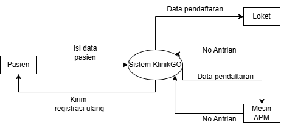
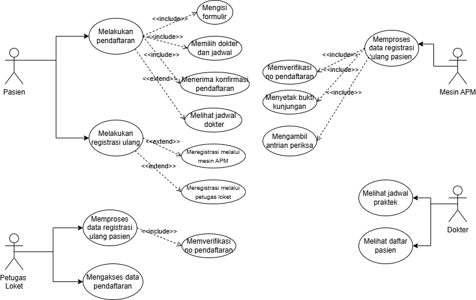
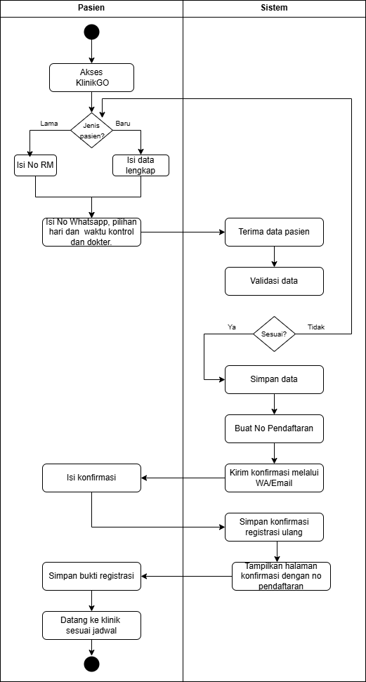
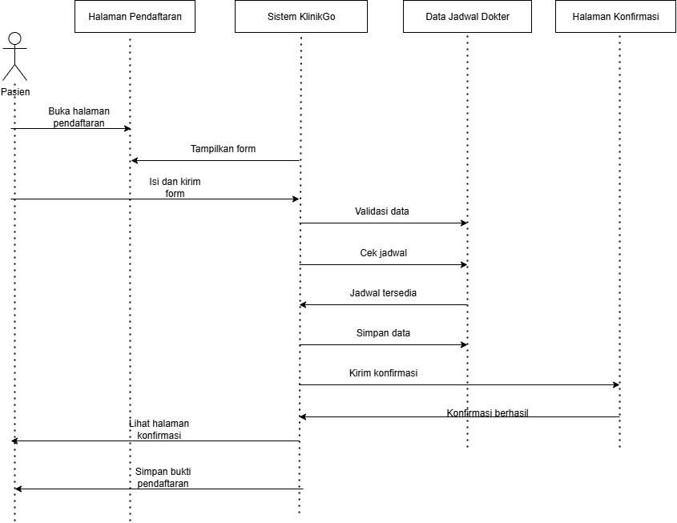

Online Patient Registration System Design
📌 Project Overview:
This project presents the system analysis and design of an online patient registration system developed during a virtual internship program. The system aims to support digital patient registration, appointment scheduling, queue management, and real-time doctor schedule updates.

🎯 Business Requirements
- Online registration for new and existing patients
- Doctor schedule selection
- WhatsApp/email notification for confirmation and schedule changes
- Online registration proof generation
- Queue number assignment based on registration order
- Different re-registration flows for BPJS and non-BPJS patients

## Diagram Preview:

## Flowchart

## DFD Level 0

## Use Case Diagram

## Activity Diagram

## Sequence Diagram

